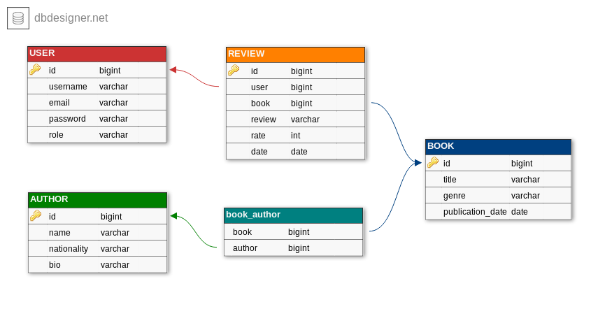
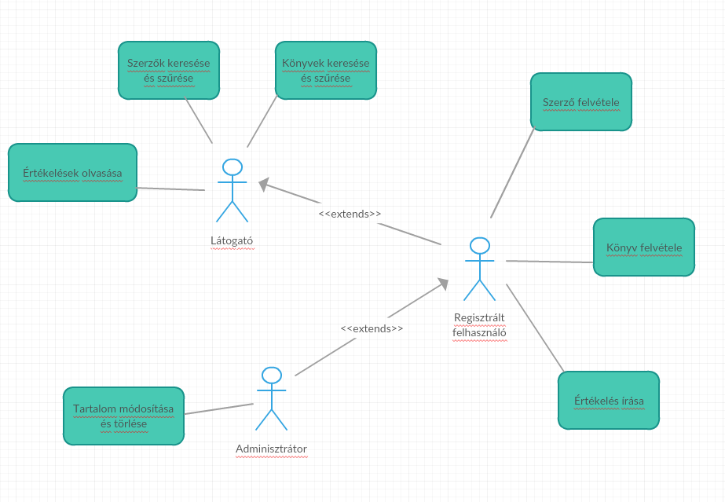
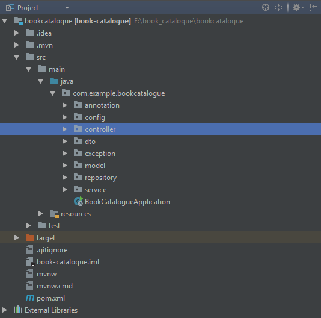

# Book catalogue
> Könyv nyilvántartó és értékelő alkalmazás

## Tervezett funkciók
- Szerző felvétele a rendszerbe
- Könyv felvétele a rendszerbe nyilvántartott szerzőtől
- Értékelés írása nyilvántartott könyvről
- Szerzők keresése és szűrése
- Könyvek keresése és szűrése
- Tartalom módosítása/törlése admin által

### Szerzők, könyvek és értékeléseik megtekintése
Az alkalmazásban elérhető tartalom, amit a regisztrált felhasználók hoznak létre, mindenki számára elérhető. Tartalom alatt értjük a szerzőket, a könyveket, és a könyvekhez tartozó értékeléseket. A szerzők és a könyvek kereséssel szűrhetőek. Egy szerzőt kiválasztva látható az adatai, valamint a könyvei. Egy könyvet kiválasztva megjelennek a hozzá kapcsolódó információk, valamint az értékelései.

### Szerző felvétele
Új szerzű felvétele a nyilvántartásba, ami a könyvek hozzáadását teszi lehetővé a regisztrált felhasználók számára. Ez egy űrlap kitöltésével történik, amiben megadjuk a szerző adatait: neve, nemzetisége, valamint életrajza (itt tetszőleges további információk lehetnek).

### Könyv felvétele
Meglévő szerző könyve rögzíthető az alkalmazással regisztrált felhasználók által, ami a könyv adatainak megadásával történik. Egy könyvnek több szerzője is lehet. Könyv adatai: szerző(k), cím, műfaj, megjelenés dátuma.

### Értékelés írása
Könyv kiválasztásával az adott könyvről szöveges értékelés írható. A szöveges értékelés egy pontszámmal is kiegészül. Ez a funkció regisztrált felhasználók számára érhető el.

## Entitások
> Az alkalmazás entitásai és a köztük lévő kapcsolatok, amelyek a [sématerven](#sématerv) is látszódnak.

### Értékelés
Egy értékelés egy könyvhöz kapcsolódik, egy könyvhöz azonban több értékelés is tartozhat. Értékelés alatt egy szöveges értékelés és egy pontszámot értünk, emellett rögzítjük az értékelés íróját(regisztrált felhasználó) és dátumát.

### Könyv
Egy könyvet jellemez a címe, műfaja és megjelenési dátuma. Szerzője több is lehet, és természetesen egy szerzőnek több könyve lehet, tehát köztük sok-sok kapcsolat áll fenn. Ennek megvalósítása kapcsolótáblával történik. Egy könyvhöz tetszőleges számú értékelés tartozhat.

### Szerző
Szerzőnek rögzítjük a nevét és nemzetiségét, további információk az ún. életrajz mezőben adhatóak meg. Szerzőhöz több könyv kapcsolódik, ez az előző pontban leírt sok-sok kapcsolat.

### Felhasználó
Az alkalmazás felhasználói 3 kategóriába sorolhatóak, jogosultságaikat [ábra](#felhasználói-szerepkörök) is szemlélteti.

#### Látogató
Az alkalmazás vendég látogatói a nem regisztrált felhasználók. Ők szabadon böngészhetik és megtekinthetik az oldalon elérhető tartalmat, azonban új tartalmat nem hozhatnak létre.

#### Regisztrált felhasználó
A regisztrált felhasználók a tartalom megtekintésén felül új tartalom létrehozására is jogosultak, legyen az szerző, könyv felvétele, vagy értékelés írása.

#### Admin
Az alkalmazás adminisztrátorai rendelkeznek értelemszerűen a legtöbb joggal. A tartalom módosításának és törlésének a joga az, ami megkülönbözteti őket a többi felhasználótól.

## Sématerv

## Felhasználói szerepkörök

##Backend réteg

###Alkalmazott könyvtárstruktúra

- annotaiton: Saját készítésű annotációk.
- controller: Az adott entitásokhoz tartozó controller osztályok.
- model: Az adatbázisban található entitások.
- repository: Az adatbázisokat kezelő osztályok.
- service:A controllerek üzleti logikáját tartalmazó osztályok.
- dto : Search engine
- exception: Kivételek
